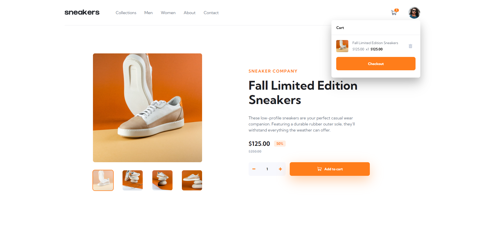

# Frontend Mentor - E-commerce product page solution

## Table of contents

- [Overview](#overview)
  - [The challenge](#the-challenge)
  - [Screenshot](#screenshot)
  - [Links](#links)
- [My process](#my-process)
  - [Built with](#built-with)
- [Author](#author)

## Overview

### The challenge

Users should be able to:

- View the optimal layout for the site depending on their device's screen size
- See hover states for all interactive elements on the page
- Open a lightbox gallery by clicking on the large product image
- Switch the large product image by clicking on the small thumbnail images
- Add items to the cart
- View the cart and remove items from it

### Screenshot

### Links

- Solution URL: [GitHub Repo](https://github.com/slenderfigure/frontend-mentor-challenge-1)
- Live Site URL: [GitHub Pages](https://slenderfigure.github.io/frontend-mentor-challenge-1/)

## My process

### Built with

- Desktop-First Workflow
- Semantic HTML5
- Accessibility in mind
- BEM Methodology
- SCSS
- Flexbox
- CSS Grid
- TypeScript
- JSON
- RxJS
- [Angular](https://angular.io/) - Angular Framework

## Author

- Frontend Mentor - [@slenderfigure](https://www.frontendmentor.io/profile/slenderfigure)
- LinkedIn - [Adison Peña](https://www.linkedin.com/in/adison-pe%C3%B1a-945b36218/)
